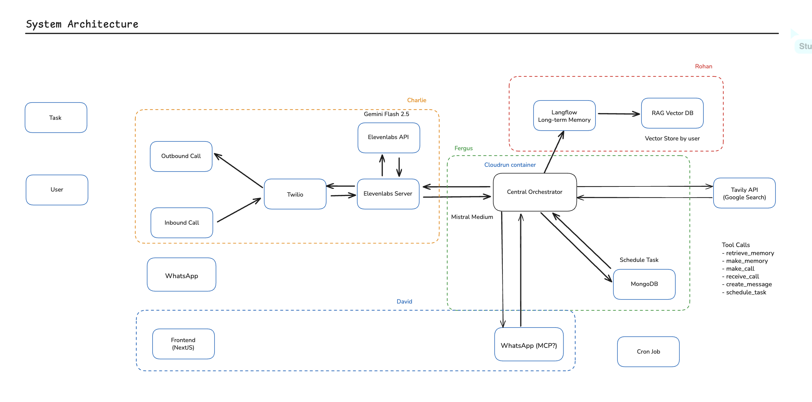
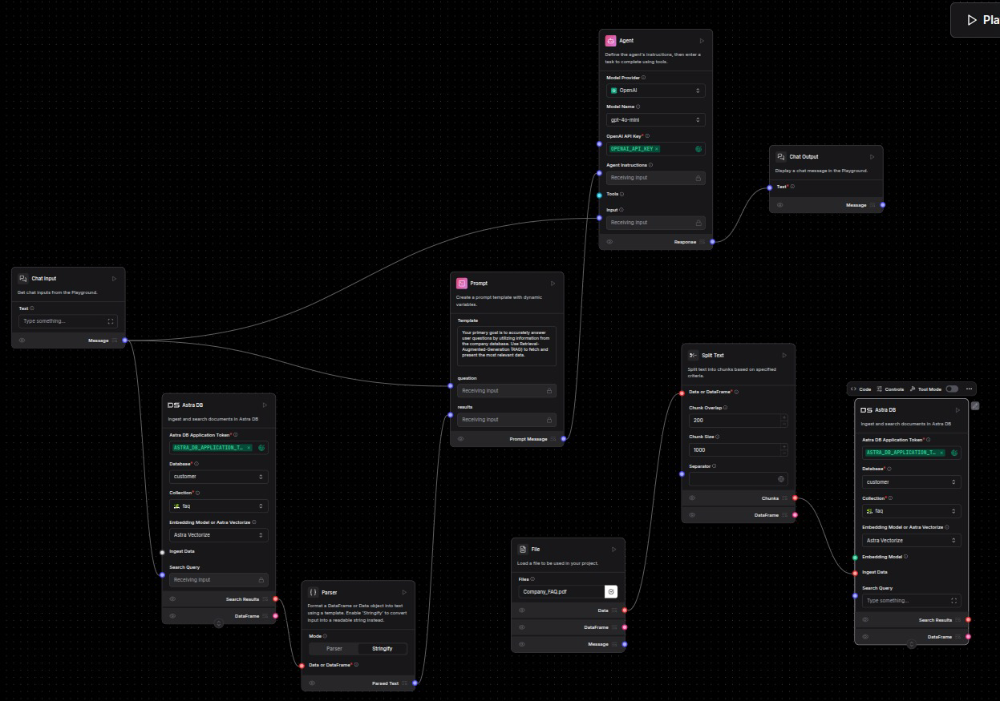

<p align="center" style="display: flex; justify-content: center; align-items: center; gap: 40px;">
  
  
</p>

# Buster - AI Voice Agent Platform
**Hackathon-Ready Voice Agent with Smart Integrations**

An intelligent voice agent platform that integrates ElevenLabs Conversational AI with Twilio for seamless phone calls, featuring voice-triggered integrations, DTMF answering machine navigation, and Mem0 brain context for personalized conversations.

## System Architecture



### Langflow Architecture



The platform consists of multiple interconnected components working together to provide a comprehensive voice agent solution:

### Core Components

- **Twilio Integration**: Handles phone call routing and real-time audio streaming via WebSocket
- **ElevenLabs Conversational AI**: Provides natural language processing and voice synthesis
- **Voice-Triggered Integrations**: Calendar, Email, and WhatsApp actions triggered by keywords
- **DTMF Handler**: Automatic answering machine navigation with tone generation
- **Mem0 Brain Context**: AI memory for personalized conversations and user preferences
- **Frontend (Next.js)**: Modern web interface with simplified integrations UI
- **Status Polling**: Real-time call status updates and transcript display

### How It Works

1. **Call Initiation**: Users initiate calls through the web interface with instructions and phone numbers
2. **Brain Context Loading**: Mem0 loads previous conversation memories and personalizes the agent
3. **Audio Processing**: Real-time audio streams through WebSocket connections between Twilio and ElevenLabs
4. **Keyword Detection**: System detects trigger words ("appointment", "email", "message") during conversations
5. **Smart Integrations**: Automatically executes Calendar, Email, or WhatsApp actions based on voice commands
6. **DTMF Navigation**: Handles answering machines with automatic DTMF tone generation
7. **Status Updates**: Real-time call progress tracking with visual feedback

## Key Features

### 🎯 Voice-Triggered Integrations
- **Calendar**: Say "schedule appointment" → automatically books meetings
- **Email**: Say "send email" → triggers email notifications  
- **WhatsApp**: Say "text message" → sends WhatsApp messages
- **Visual Feedback**: See integration actions in real-time during calls

### 🤖 DTMF Answering Machine Navigation
- **Auto-Detection**: Recognizes voicemail greetings and automated systems
- **Smart Navigation**: Automatically presses appropriate keys (1 to skip, 0 for operator)
- **Seamless Experience**: Handles answering machines without human intervention

### 🧠 Mem0 Brain Context
- **Personalized Conversations**: Remembers previous interactions and preferences
- **Dynamic Greetings**: Custom welcome messages based on caller history
- **Context Injection**: Enhances ElevenLabs agent with relevant memories

### 📊 Real-Time Status Updates
- **Live Tracking**: See call progress, connection status, and transcript updates
- **Visual Indicators**: Blinking integration status and call state indicators
- **Persistent Display**: Status updates that don't "poof" during active calls

## Setup Instructions

### Prerequisites

- Node.js (v18 or higher)
- npm or yarn package manager
- Twilio account with phone number
- ElevenLabs API access
- Mem0 API key (optional, for brain context)
- ngrok (for local development)

### 1. Clone the Repository

```bash
git clone https://github.com/mousberg/buster.git
cd buster
```

### 2. Backend Setup

```bash
# Navigate to the backend directory
cd inbound

# Install dependencies
npm install

# Copy environment configuration
cp env.yaml.example env.yaml
```

Edit `inbound/env.yaml` with your API keys and configuration:

```yaml
ELEVENLABS_API_KEY: "your_elevenlabs_api_key"
ELEVENLABS_AGENT_ID: "your_agent_id"
TWILIO_ACCOUNT_SID: "your_twilio_account_sid"
TWILIO_AUTH_TOKEN: "your_twilio_auth_token"
TWILIO_PHONE_NUMBER: "your_twilio_phone_number"
MEM0_API_KEY: "your_mem0_api_key"  # Optional, for brain context
```

### 3. Frontend Setup

```bash
# Navigate to the frontend directory
cd ../frontend

# Install dependencies
npm install

# Start the development server
npm run dev
```

The frontend will be available at `http://localhost:3000`

### 4. Development Environment

Start the backend server:

```bash
# In the inbound directory
node index.js
```

Set up ngrok tunnel for local development:

```bash
# Install ngrok if not already installed
# Then create a tunnel to your local server
ngrok http --url=your-static-url 8000
```

### 5. Twilio Configuration

1. Log into your Twilio Console
2. Navigate to Phone Numbers → Manage → Active Numbers
3. Click on your Twilio phone number
4. Set the webhook URL for incoming calls:
   ```
   https://your-ngrok-url.ngrok.io/twilio/inbound_call
   ```
5. Set the webhook method to `POST`
6. Save the configuration

### 6. Testing the Setup

#### Test Voice-Triggered Integrations
1. Open the frontend at `http://localhost:3001`
2. Click the ⚡ integrations button
3. Toggle on Calendar, Email, or WhatsApp
4. Make a test call and say trigger words like "schedule appointment"
5. Watch integration actions appear in the call transcript

#### Test DTMF Navigation
1. Call a number with an answering machine or automated system
2. Watch the console logs for DTMF detection and tone generation
3. The system will automatically navigate voicemail menus

#### Test Mem0 Brain Context
1. Visit `/demo` page to create test memories
2. Make calls with the same phone number
3. Notice personalized greetings and context-aware responses

### 7. Deployment (Optional)

#### Backend Deployment to Google Cloud Run

```bash
# In the inbound directory
gcloud config set project YOUR_PROJECT_ID
gcloud builds submit --config cloudbuild.yaml
```

#### Frontend Deployment

The frontend can be deployed to platforms like Vercel, Netlify, or any service supporting Next.js:

```bash
# Build for production
npm run build

# Start production server
npm start
```

### 8. GitHub Actions Setup (Optional)

To enable automated code reviews and Claude bot integration:

1. Add `ANTHROPIC_API_KEY` to your repository secrets
2. The workflows in `.github/workflows/` will automatically activate for PRs and issues
3. Use `@claude` mentions in issues and PRs to trigger the Claude bot

## Troubleshooting

### Common Issues

1. **Connection Issues**: Verify your ngrok URL is correctly configured in Twilio
2. **API Key Errors**: Double-check all API keys in your environment configuration
3. **WebSocket Errors**: Ensure your firewall allows WebSocket connections
4. **Audio Quality**: Check your internet connection and Twilio account limits

### Support

For issues and questions:
- Check the `CLAUDE.md` file for detailed technical information
- Review the GitHub Actions workflows for automation setup
- Consult the individual component documentation in their respective directories
